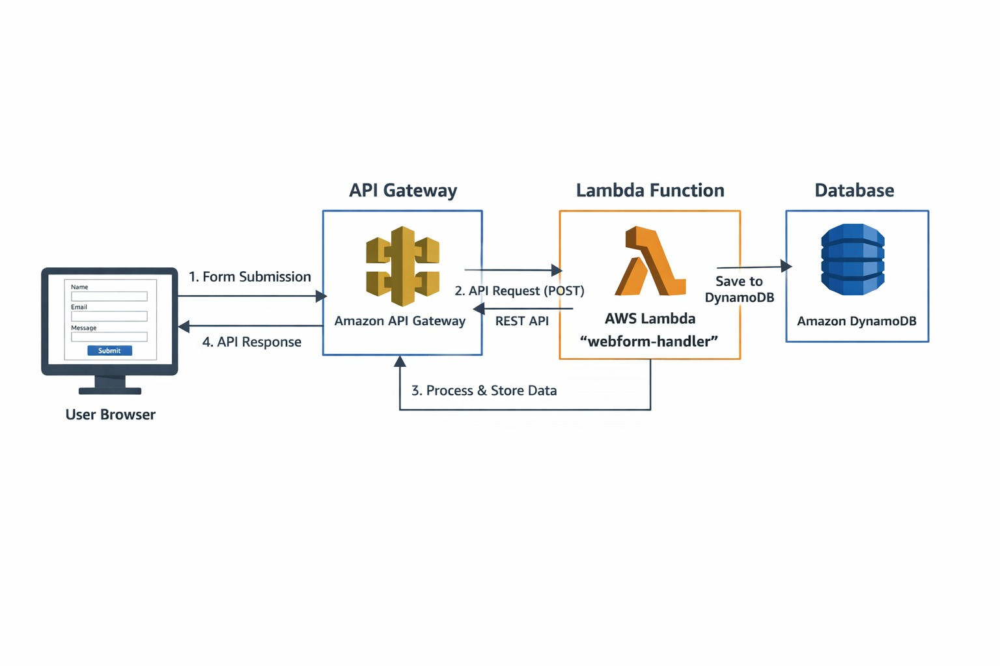
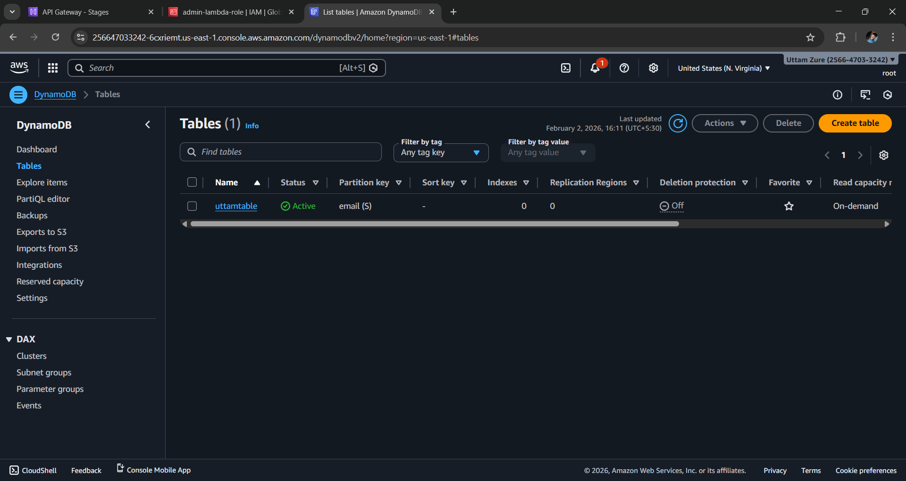
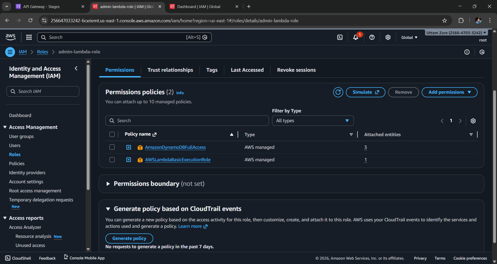
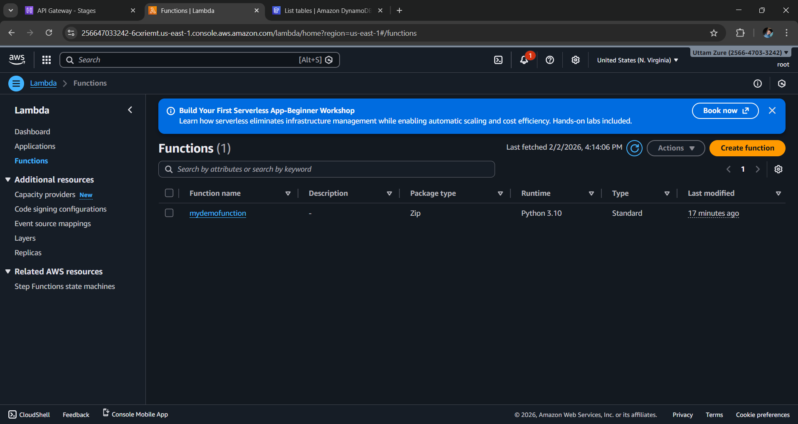
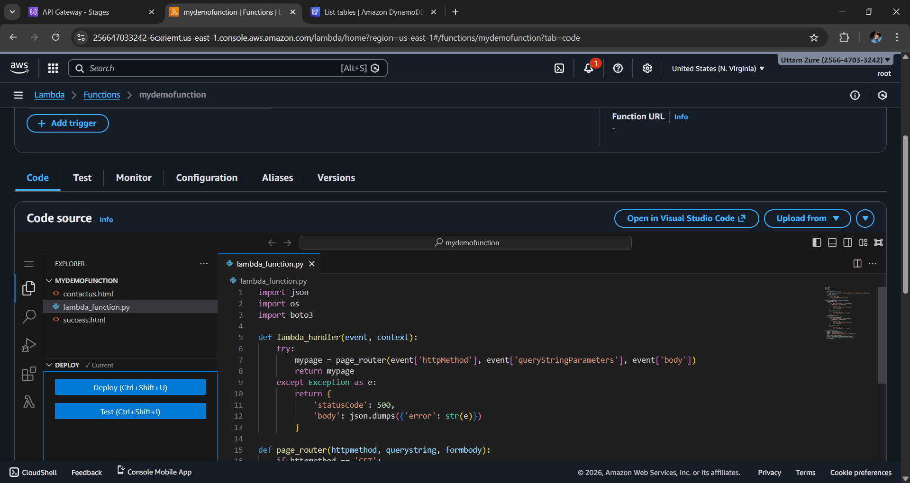
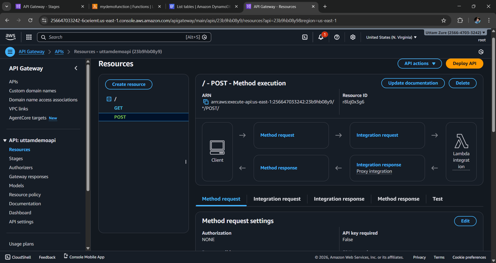
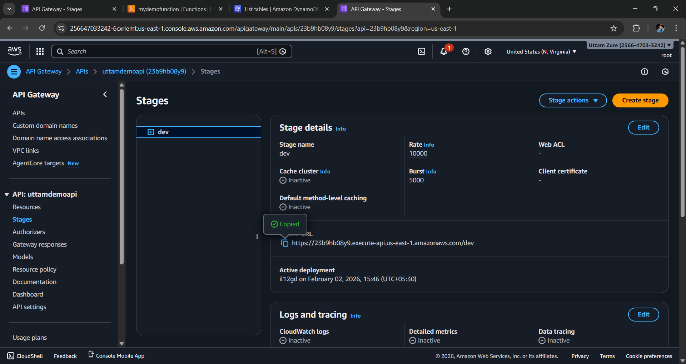
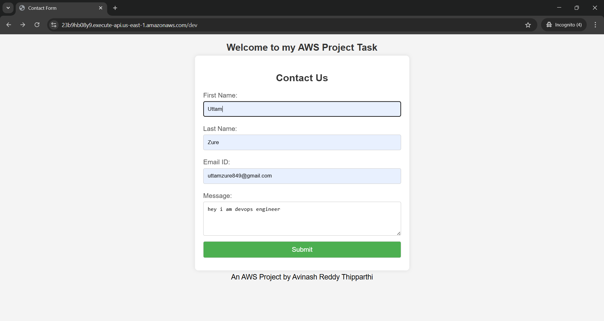
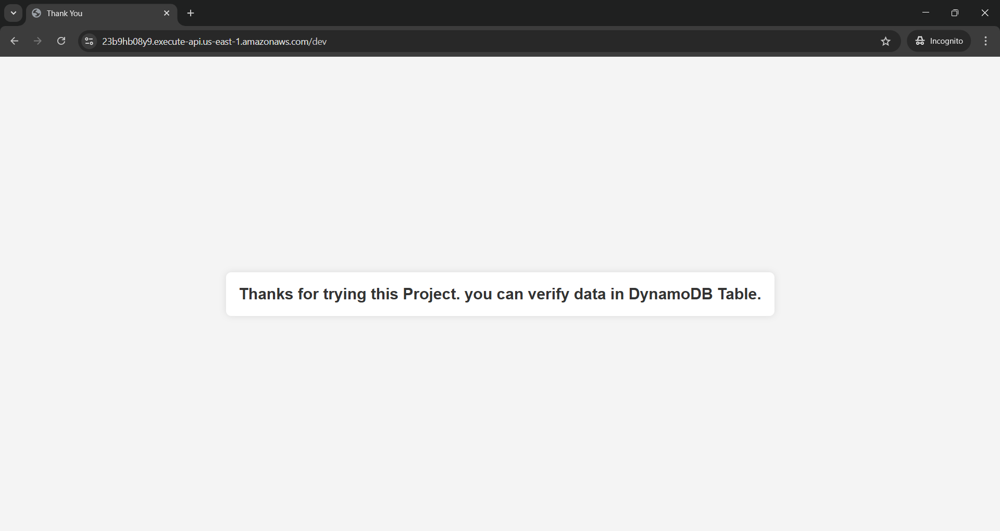
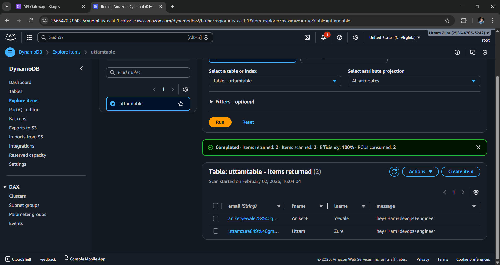

# 📌 Serverless Web Form Application

This project demonstrates how to deploy a **serverless web form application** using **AWS Lambda, API Gateway, and DynamoDB**. The application collects user data through a web form and securely stores it in DynamoDB—without provisioning or managing any servers.

---

## 🧰 Tech Stack

- **Frontend**: HTML, CSS, JavaScript  
- **Backend**: AWS Lambda (Python)  
- **Database**: Amazon DynamoDB  
- **API Layer**: Amazon API Gateway (REST API)  
- **Security**: IAM Roles & Policies  

---

## 🗂️ Project Architecture

---

## 🧩 Step 1: Create DynamoDB Table

1. Navigate to **AWS Console → DynamoDB → Create table**  
2. **Table name**: `uttamtable`  
3. **Partition key**: `email` (String)  
4. Click **Create table**

---

---

## 🧩 Step 2: Create IAM Role for Lambda

1. Go to **IAM → Roles → Create role**  
2. Select **AWS service → Lambda**  
3. Attach the following policies:  
   - `AmazonDynamoDBFullAccess`  
   - `AWSLambdaBasicExecutionRole`  
4. **Role name**: `admin-lambda-role`

---

---

## 🧩 Step 3: Create Lambda Function

1. Navigate to **AWS Console → Lambda → Create function**  
2. **Function name**: `webdemofunction`  
3. **Runtime**: Python 3.10  
4. **Execution role**: Use existing role  
5. Select role: `admin-lambda-role`

---

---

### 🧑‍💻 Upload Lambda Function Code

Upload the Lambda function ZIP file and click **Deploy**.

---

---

## 🧩 Step 4: Create API Gateway

1. Navigate to **API Gateway → Create API**  
2. Choose **REST API**  
3. **API name**: `uttamdemoapi`
4. Create **GET** and **POST** methods  
5. **Integration type**: Lambda Function  
6. Select the region and Lambda function `webform-handler`

---

---

## 🚀 Deploy API

1. Click **Actions → Deploy API**  
2. **Stage name**: `dev`  
3. Copy the **Invoke URL**

---

### Invoke URL

---

## 🧪 Testing & Output

### 1. Access the Application

Paste the **Invoke URL** into a web browser.

---

---

### 2. Submit the Form

Fill in the form details and submit.

---

---

### 3. Verify Data in DynamoDB

1. Go to **DynamoDB → Explore items**  
2. Confirm that the submitted data is stored successfully

---

---

## 📌 Key Benefits

- Zero server management  
- Highly scalable and cost-effective  
- Secure access using IAM roles  

---

## 🏁 Conclusion

This project provides a clear, hands-on example of **AWS serverless architecture**, making it especially useful for **Cloud and DevOps freshers** to understand how core AWS services work together in a real-world use case.

---

## 🔴 Summary

**Serverless Web Form Application (AWS)**  
Built a serverless form submission system using AWS Lambda, API Gateway, and DynamoDB. Implemented REST APIs, backend processing in Python, IAM-based security, and reliable data storage in DynamoDB—achieving high scalability with zero server management.